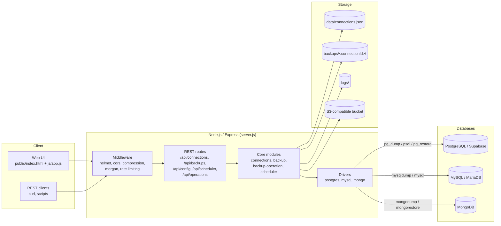
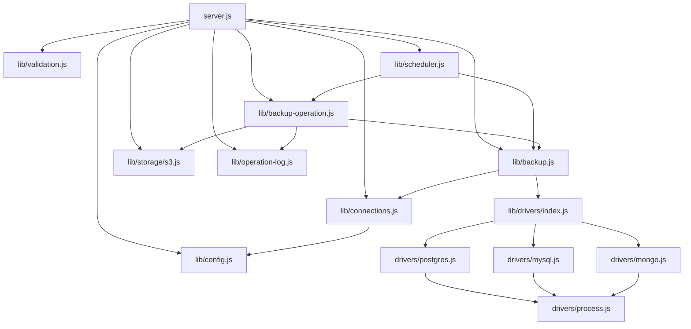
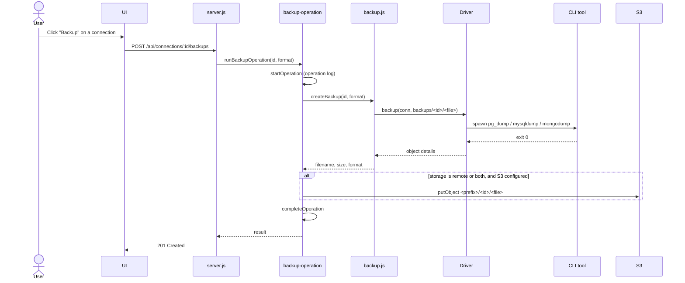
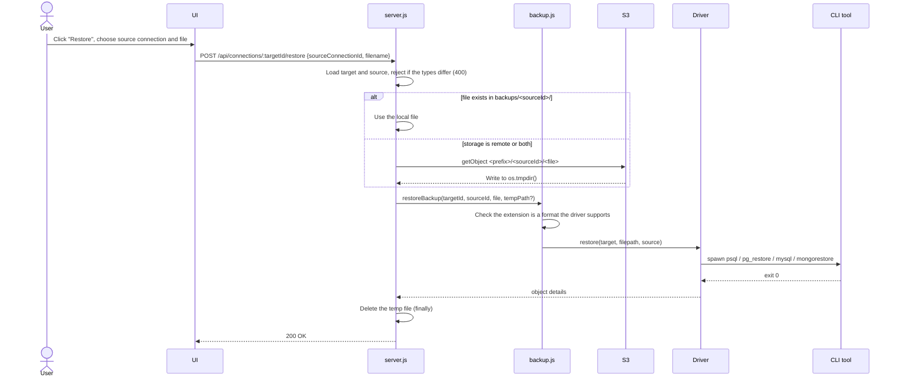
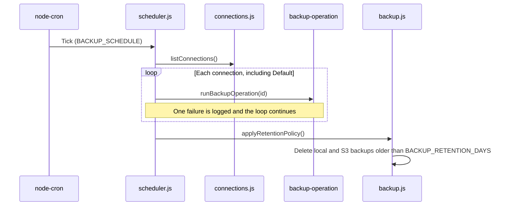
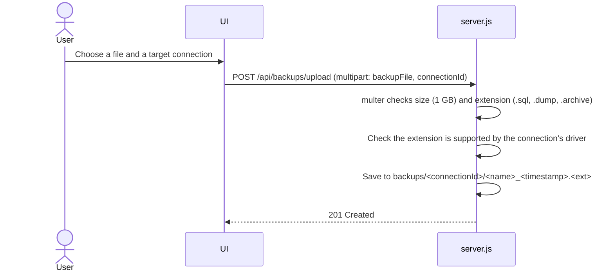
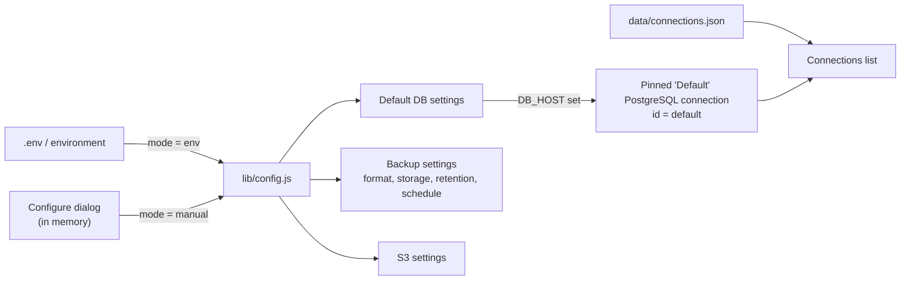
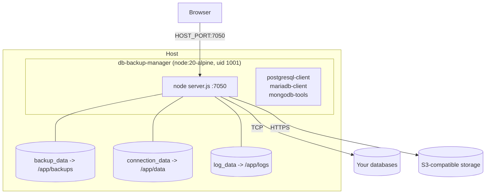

# Architecture

This document explains how **DB Backup Manager** is put together: the main modules, how a backup or restore moves through the system, where data is stored, and how the app is deployed. It's written for contributors and for operators who want to understand what the app does to their databases.

## Table of contents

- [Design principles](#design-principles)
- [System overview](#system-overview)
- [Module map](#module-map)
- [Database drivers](#database-drivers)
- [Request flows](#request-flows)
- [Data and storage layout](#data-and-storage-layout)
- [Configuration modes and the Default connection](#configuration-modes-and-the-default-connection)
- [Deployment](#deployment)
- [Security model](#security-model)
- [Extending the system](#extending-the-system)

---

## Design principles

- **Use the official tools.** Backups and restores use each engine's own CLI tools (`pg_dump`, `mysqldump`, `mongodump`, …), so the files are standard and can be restored without this app.
- **One driver per database type.** Everything specific to an engine lives in `lib/drivers/<type>.js`. The rest of the app doesn't know which engine it's talking to.
- **No shell.** Child processes are started with `spawn` and an argument array. Passwords go through environment variables (`PGPASSWORD`, `MYSQL_PWD`) or a Mongo URI, never through a shell string.
- **Simple persistence.** Connections live in a JSON file, backups are plain files on disk or in S3, and there's no database of its own to run.
- **Isolation per connection.** Every connection has its own backup folder and S3 prefix, so file names can never collide.

---

## System overview



---

## Module map



| Module | Responsibility |
| --- | --- |
| `server.js` | Express app, middleware, REST routes, upload handling, resolving files from local disk or S3 |
| `lib/connections.js` | Load and save `connections.json`, validation and uniqueness checks, the virtual Default connection, hiding secrets |
| `lib/drivers/*` | Engine-specific connection tests, backups and restores |
| `lib/drivers/process.js` | `runCommand()`: spawns a CLI tool without a shell, collects output, maps a missing binary to a clear error |
| `lib/backup.js` | File naming, per-connection folders, `createBackup`, `restoreBackup`, local listing, retention |
| `lib/backup-operation.js` | Runs a backup as a logged operation: create, optionally upload to S3, record each step |
| `lib/storage/s3.js` | S3 client, upload/download/delete/list under `<prefix>/<connectionId>/`, merging local and remote listings, statistics |
| `lib/scheduler.js` | `node-cron` job that backs up every connection, then applies the retention policy |
| `lib/config.js` | ENV and Manual configuration modes for the Default database, backups and S3 |
| `lib/operation-log.js` | Operation timeline (backup, restore, upload) saved to `logs/operations-log.json` |
| `lib/validation.js` | `express-validator` rules and filename sanitizing |
| `lib/logger.js` | Winston logger (console plus rotating files in `logs/`) |
| `public/` | Single-page UI written in plain JavaScript, with no build step |

---

## Database drivers

Every driver exports the same interface:

```js
export const type;           // "postgres" | "mysql" | "mongodb"
export const label;          // Name shown in the UI
export const defaultPort;    // 5432 | 3306 | 27017
export const formats;        // File extensions it can produce and restore

export function resolveFormat(requested);   // Pick a supported format
export function extension(format);          // File extension for a format
export async function testConnection(conn); // -> { serverTime, version }
export async function backup(conn, filepath, format);        // -> { tables | collections, ... }
export async function restore(target, filepath, sourceConn); // -> { tables | collections, ... }
```

| Driver | Test with | Backup | Restore | Formats |
| --- | --- | --- | --- | --- |
| PostgreSQL | `pg` | `pg_dump` (`-F p` or `-F c`, optional `-n <schema>`, `--exclude-table`) | `.sql`: drop and recreate the target schema, then `psql -v ON_ERROR_STOP=1 -f`. `.dump`: `pg_restore -c --no-owner` | `sql`, `dump` |
| MySQL | `mysql2` | `mysqldump --single-transaction --routines --triggers --no-tablespaces` | `mysql < file` | `sql` |
| MongoDB | `mongodb` | `mongodump --archive --gzip --db` | `mongorestore --archive --gzip --drop`, with `--nsFrom/--nsTo` when the database name differs | `archive` |

Notes:

- The MySQL driver checks `mysqldump --version` once and uses MariaDB-style (`--ssl` / `--skip-ssl`) or Oracle-style (`--ssl-mode=`) TLS flags to match the installed client.
- Restoring a PostgreSQL `.sql` file runs `DROP SCHEMA ... CASCADE` on the target schema (`public` unless the connection sets one). Restores are destructive by design.
- PostgreSQL SSL maps to `PGSSLMODE`: `disable` when off, and `require` when on (`prefer` for local hosts).
- MongoDB builds a `mongodb://` or `mongodb+srv://` URI that includes `authSource` and `tls`.
- The names of dumped objects (tables, sequences, collections) are read from the dump output and shown as steps in the operation timeline.

---

## Request flows

### Instant backup



If a backup fails, the half-written file is deleted and the operation is marked failed.

### Restore, including restoring from another connection



### Scheduled backup and retention



### Upload



---

## Data and storage layout

### `data/connections.json`

```json
[
  {
    "id": "3f0c9a7e-2b1d-4a51-9a3e-0d7c2f1b8e44",
    "title": "Orders (production)",
    "type": "mysql",
    "host": "db.example.com",
    "port": 3306,
    "database": "orders",
    "user": "backup",
    "password": "plain-text",
    "options": { "sslMode": "on", "excludeTables": ["sessions"] },
    "createdAt": "2026-09-28T10:00:00.000Z",
    "updatedAt": "2026-09-28T10:00:00.000Z"
  }
]
```

| Type | `options` keys |
| --- | --- |
| `postgres` | `schema`, `excludeTables[]`, `sslMode` (`on` / `off`) |
| `mysql` | `excludeTables[]`, `sslMode` (`on` / `off`) |
| `mongodb` | `authSource`, `excludeCollections[]`, `tls`, `srv` |

**Uniqueness rules**

- The combination of `type`, `host` (case-insensitive), `port` and `database` must be unique. Violations return `409 Conflict`.
- `title` must be unique, ignoring case.

The API never returns passwords. Clients get `hasPassword: true/false` instead, and a blank password on update keeps the stored one.

### Backup files

```
backups/                                  S3: <bucket>/<AWS_S3_PREFIX>/
├── default/                                  ├── default/
│   └── backup_postgres_app_<ts>.sql          │   └── backup_postgres_app_<ts>.sql
├── 3f0c9a7e-.../                             ├── 3f0c9a7e-.../
│   └── backup_mysql_orders_<ts>.sql          │   └── backup_mysql_orders_<ts>.sql
└── 8b21d6c4-.../                             └── 8b21d6c4-.../
    └── backup_mongodb_events_<ts>.archive        └── backup_mongodb_events_<ts>.archive
```

File names follow `backup_<type>_<database>_<ISO timestamp>.<ext>`. When storage is `both`, local and S3 listings are merged, and a file found in both places is reported with location `both`.

### Logs

| Path | Contents |
| --- | --- |
| `logs/combined-<date>.log`, `logs/error-<date>.log` | Winston application logs, rotated daily (plus `exceptions-*` and `rejections-*`) |
| `logs/operations-log.json` | Operation timeline shown in the UI: each step's operation id, type, connection, file, status and time |

---

## Configuration modes and the Default connection



- **ENV mode** (the default) reads everything from environment variables.
- **Manual mode** lets the UI change the Default database, backup and S3 settings at runtime. These settings are kept in memory and reset when the app restarts.
- The **Default** connection is virtual. It's built from the database settings of the active mode and only appears when a host is configured. It can't be edited or deleted from the list.
- Saved connections in `connections.json` behave the same in both modes.

---

## Deployment

### Docker Compose



- A multi-stage Dockerfile: the production dependencies are installed in one stage and copied into a slim runtime stage with the client tools.
- The app runs as the non-root user `nodejs` (UID `1001`).
- A healthcheck (`docker-healthcheck.sh`) calls `GET /health`.
- `/app/backups`, `/app/data` and `/app/logs` are declared as volumes, so no state lives in the container layer.

### Dev stack

`docker-compose.dev.yml` extends the base file with `postgres:16-alpine`, `mysql:8.4` and `mongo:7`, each with a healthcheck. `dbm` waits for them with `depends_on: condition: service_healthy`. Inside the Compose network the databases are reachable as `postgres`, `mysql` and `mongo`, and from the host on ports `15432`, `13306` and `27018`.

---

## Security model

| Area | Current behavior | Recommendation |
| --- | --- | --- |
| Authentication | **None.** Anyone who can reach the port can back up, restore and read credentials in use. | Run on a private network, or behind a reverse proxy with authentication (basic auth, OAuth proxy, VPN). |
| Stored credentials | `connections.json` stores passwords in **plain text**. | Protect the `connection_data` volume, and use database users that only have backup and restore rights. |
| Credentials in transit to tools | Passed through environment variables or a URI, never shell-interpolated | — |
| Process execution | `spawn` with argument arrays, no shell | — |
| Input validation | `express-validator` for bodies and params. Connection ids must match `^[a-zA-Z0-9-]+$`, and file names are reduced to their base name. | — |
| Upload limits | 1 GB, extension allow-list per driver | Also set a size limit at the reverse proxy |
| HTTP hardening | `helmet` (CSP, HSTS), rate limits of 100 requests per 15 minutes overall and 20 for sensitive routes | — |
| API responses | Passwords are never returned (`hasPassword` flag instead) | — |
| Container | Non-root UID `1001`, minimal Alpine image | Keep the image up to date |

Please report vulnerabilities privately through [GitHub Security Advisories](https://github.com/aamaruf/dbm/security/advisories/new).

---

## Extending the system

To add a new database type (see [Contributing](README.md#-contributing) for the full checklist):

1. Create `lib/drivers/<type>.js` implementing the [driver interface](#database-drivers).
2. Register it in `lib/drivers/index.js`, and add any new file extension to `BACKUP_EXTENSIONS`.
3. Add the type to `DB_TYPES` and its options to `normalizeOptions()` in `lib/connections.js`, then update `lib/validation.js`.
4. Add the type's option fields to the connection modal in `public/index.html` and `public/js/app.js`.
5. Install its client tools in the `Dockerfile` and add them to the checks in `setup.sh` and `setup.bat`.
6. Add a sample service to `docker-compose.dev.yml`, and document the type in the README.

Oracle is on the [roadmap](README.md#-roadmap) and would follow the same pattern (for example `expdp`/`impdp` or `exp`/`imp`).
