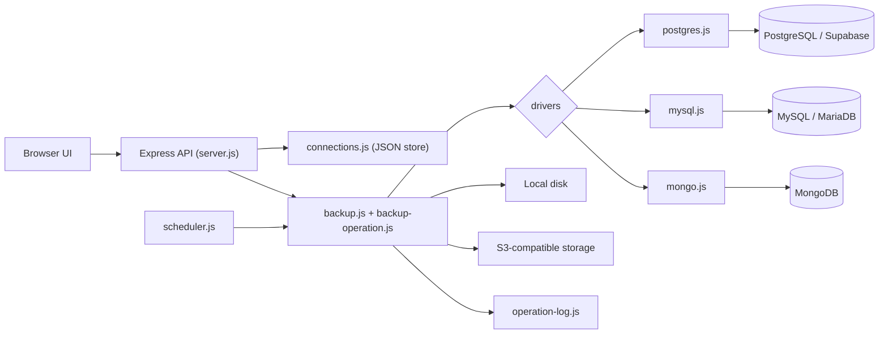

<div align="center">

# DB Backup Manager

**A self-hosted web app to back up and restore PostgreSQL, MySQL and MongoDB databases to local disk or any S3-compatible storage.**

Save all your connections in one place, run a backup with one click, and restore any backup into any compatible database, such as production into staging.

[](LICENSE)
[](https://nodejs.org/)
[](#-quick-start)
[](#-contributing)


[Quick start](#-quick-start) ·
[Installation](INSTALLATION.md) ·
[API](API.md) ·
[Architecture](ARCHITECTURE.md) ·
[Report a bug](https://github.com/aamaruf/dbm/issues)

</div>

---

## Table of contents

- [Features](#-features)
- [Supported databases](#-supported-databases)
- [Quick start](#-quick-start)
- [Connecting your databases](#-connecting-your-databases)
- [Using the app](#-using-the-app)
- [Configuration](#%EF%B8%8F-configuration)
- [Storage layout](#-storage-layout)
- [API overview](#-api-overview)
- [Architecture at a glance](#-architecture-at-a-glance)
- [Security](#-security)
- [Troubleshooting](#-troubleshooting)
- [Roadmap](#-roadmap)
- [Contributing](#-contributing)
- [Author](#-author)
- [License](#-license)

---

## ✨ Features

| | |
| --- | --- |
| **Multiple database types** | PostgreSQL, MySQL (and MariaDB) and MongoDB, plus managed services such as Supabase, RDS, Cloud SQL and Atlas. |
| **Saved connections** | Keep any number of connections, each with a readable title. The app won't let you save the same database (type + host + port + database) twice. |
| **One-click backups** | Every connection row has **Backup** and **Restore** buttons. |
| **Cross-connection restore** | Pick a source connection and a backup file from dropdowns, then restore it into any connection of the same type. |
| **Local and S3-compatible storage** | Store backups locally, in S3, or both. Works with AWS S3, Supabase Storage, MinIO, DigitalOcean Spaces, Backblaze B2, Cloudflare R2 and others. |
| **Scheduler and retention** | Cron-based auto-backups of every connection, and backups older than N days are deleted automatically. |
| **Operation timeline** | Step-by-step logs for each backup, restore and upload, down to individual tables and collections. |
| **Upload external backups** | Import `.sql`, `.dump` or `.archive` files and restore them from the UI. |
| **Two configuration modes** | *ENV* mode reads settings from environment variables; *Manual* mode lets you change them from the UI at runtime. |
| **Hardened by default** | Helmet/CSP, rate limiting, input validation, a non-root Docker user, and database tools run without a shell so saved values can't inject commands. |

---

## 🗄 Supported databases

| Database | Client tools used | Backup format | How restore works |
| --- | --- | --- | --- |
| **PostgreSQL** | `pg_dump`, `psql`, `pg_restore` | `.sql` (plain) or `.dump` (custom, compressed) | `.dump` runs `pg_restore -c --no-owner`. `.sql` drops and recreates the schema, then runs `psql`. |
| **MySQL / MariaDB** | `mysqldump`, `mysql` | `.sql` | The file is piped into `mysql`. The dump already includes `DROP TABLE IF EXISTS`. |
| **MongoDB** | `mongodump`, `mongorestore` | `.archive` (gzipped) | `mongorestore --drop`. Collections are remapped automatically when the target database has a different name. |
| **Supabase** | via PostgreSQL | via PostgreSQL | See the [Supabase guide](#supabase). |

> The Docker image already includes all the client tools. For local installs, you only need the tools for the database types you use.

---

## 🚀 Quick start

### Option 1: Docker (recommended)

```bash
git clone https://github.com/aamaruf/dbm.git
cd dbm
docker compose up -d
```

Open **http://localhost:7050**, click **Add Connection**, and you're ready to go. You don't need a `.env` file.

### Option 2: Local (Node.js)

```bash
git clone https://github.com/aamaruf/dbm.git
cd dbm
yarn install          # or: npm install
cp .env.example .env  # optional
yarn start
```

This needs Node.js 20+ and the client tools for the databases you use. See [INSTALLATION.md](INSTALLATION.md) for per-OS instructions.

### Option 3: Try it with sample databases

The dev stack starts the app alongside sample PostgreSQL, MySQL and MongoDB servers, which is handy for demos and for contributors:

```bash
docker compose -f docker-compose.yml -f docker-compose.dev.yml up -d --build
```

Then add these connections in the UI:

| Type | Host | Port | User | Password | Database |
| --- | --- | --- | --- | --- | --- |
| PostgreSQL | `postgres` | `5432` | `dbm` | `dbm` | `demo` |
| MySQL | `mysql` | `3306` | `dbm` | `dbm` | `demo` |
| MongoDB | `mongo` | `27017` | `dbm` | `dbm` | `demo` (Auth Source `admin`) |

---

## 🔌 Connecting your databases

Click **Add Connection** and choose a database type. The default port fills in automatically. Every type has these fields:

| Field | Notes |
| --- | --- |
| **Title** | A readable name shown in the list. Must be unique. |
| **Host / Port** | The database server address. |
| **Username / Password** | When you edit a connection, leave the password blank to keep the saved one. |
| **Database** | The database to back up and restore. |

Each type also has its own options:

| Type | Options |
| --- | --- |
| PostgreSQL | **Schema** (leave empty for all schemas), **Exclude tables**, **Use SSL** |
| MySQL | **Exclude tables**, **Use SSL** |
| MongoDB | **Auth source** (default `admin`), **Exclude collections**, **Use TLS**, **SRV record** (`mongodb+srv`, e.g. Atlas) |

Saving a connection tests it first, so a connection that can't be reached is never saved.

### Supabase

Supabase is PostgreSQL, so add it as a **PostgreSQL** connection:

| Field | Value |
| --- | --- |
| Host | `aws-0-<region>.pooler.supabase.com` (the **Session pooler** host from *Project Settings → Database → Connection string*) |
| Port | `5432` |
| Username | `postgres.<project-ref>` |
| Password | Your database password |
| Database | `postgres` |
| Schema | `public` (recommended) |
| Use SSL | **On** |

Tips:

- **Use the Session pooler.** The direct host (`db.<ref>.supabase.co`) only has an IPv6 address, which most Docker networks can't reach.
- **Don't use the Transaction pooler** (port `6543`). `pg_dump` doesn't work through it.
- **Set Schema to `public`** (or your own schemas) so the backup skips the schemas Supabase manages itself (`auth`, `storage`, `realtime`, …).
- **Use the `.dump` format** (Configure → Backup → Backup Format) for backups you'll restore into Supabase. Restores run `pg_restore --no-owner`, which avoids role and ownership errors.

Supabase Storage also works as the S3 backend. See [S3-compatible storage](#s3-compatible-storage).

---

## 🧭 Using the app

1. **Add a connection.** Click *Add Connection*, pick the type, and fill in the fields. The connection appears in the **Connections** list.
2. **Back it up.** Click **Backup** on the row. The file appears in **Recent Backups**, and each step is recorded in the **Operation Log**.
3. **Restore.** Click **Restore** on the row you want to overwrite, then choose:
   - the **source connection** (only connections of the same type are listed, and it defaults to the same connection), and
   - the **backup file** from that source.
4. **Upload.** Click *Upload Backup File*, choose the target connection, then choose a file.
5. **Browse.** Filter *Recent Backups* by connection, and download or delete files.
6. **Automate.** Turn on *Auto-Backup* to back up every connection on a cron schedule, with retention applied afterwards.

> ⚠️ A restore **overwrites** data in the target database. Test on a staging connection first.

---

## ⚙️ Configuration

All environment variables are **optional**. See [.env.example](.env.example) for the full, commented list.

| Variable | Default | Description |
| --- | --- | --- |
| `PORT` | `7050` | HTTP port. |
| `CONFIG_MODE` | `env` | `env` reads settings from environment variables. `manual` lets you change them in the UI (kept in memory, lost on restart). |
| `DATA_DIR` | `./data` | Where saved connections (`connections.json`) are stored. |
| `DB_HOST`, `DB_PORT`, `DB_USER`, `DB_PASSWORD`, `DB_NAME` | – | Adds a pinned **Default** PostgreSQL connection. Leave `DB_HOST` empty to skip it. |
| `DB_SCHEMA`, `DB_EXCLUDE_TABLES`, `DB_SSL` | – | Options for the Default connection. |
| `BACKUP_STORAGE` | `local` | `local`, `remote` (S3), or `both`. |
| `BACKUP_LOCAL_PATH` | `./backups` | Local backup root. |
| `BACKUP_FORMAT` | `sql` | Format for PostgreSQL backups: `sql` or `dump`. |
| `BACKUP_AUTO` | `false` | Start the scheduler on boot. |
| `BACKUP_SCHEDULE` | `0 2 * * *` | Cron expression for the scheduler. |
| `BACKUP_RETENTION_DAYS` | `7` | Delete backups older than this many days after each scheduled run. |
| `AWS_ACCESS_KEY_ID`, `AWS_SECRET_ACCESS_KEY`, `AWS_REGION`, `AWS_S3_BUCKET` | – | S3 credentials and bucket. |
| `AWS_S3_PREFIX` | – | Optional folder inside the bucket. |
| `AWS_S3_ENDPOINT`, `AWS_S3_FORCE_PATH_STYLE` | – | For S3-compatible services. Path style is detected automatically for known providers. |
| `LOG_LEVEL` | `info` | Winston log level. |

### S3-compatible storage

```env
BACKUP_STORAGE=both
AWS_ACCESS_KEY_ID=...
AWS_SECRET_ACCESS_KEY=...
AWS_REGION=us-east-1
AWS_S3_BUCKET=db-backups
# Leave empty for AWS. Examples for other providers:
AWS_S3_ENDPOINT=https://<project-ref>.supabase.co/storage/v1/s3   # Supabase Storage
# AWS_S3_ENDPOINT=http://minio:9000                               # MinIO
# AWS_S3_ENDPOINT=https://nyc3.digitaloceanspaces.com             # DigitalOcean Spaces
```

### Cron examples

| Schedule | Meaning |
| --- | --- |
| `0 2 * * *` | Every day at 02:00 |
| `0 */6 * * *` | Every 6 hours |
| `0 0 * * 0` | Every Sunday at midnight |
| `*/30 * * * *` | Every 30 minutes |

---

## 📁 Storage layout

```
data/
└── connections.json                  # saved connections (plain-text passwords)
backups/
├── default/                          # the ENV/Manual "Default" connection
│   └── backup_postgres_app_2026-01-01T02-00-00-000Z.dump
└── 3f1c9a.../                        # one folder per connection id
    └── backup_mysql_shop_2026-01-01T02-00-00-000Z.sql
s3://<bucket>/<prefix>/<connectionId>/<filename>
```

Deleting a connection **keeps** its backup files.

---

## 📡 API overview

Everything the UI does is available through a REST API. Full reference: **[API.md](API.md)**.

| Method | Endpoint | Purpose |
| --- | --- | --- |
| `GET` | `/api/connections` | List connections with backup count and last backup time |
| `POST` | `/api/connections` | Test and save a connection |
| `PUT` / `DELETE` | `/api/connections/:id` | Update or delete a connection |
| `POST` | `/api/connections/test` | Test an unsaved connection |
| `POST` | `/api/connections/:id/backups` | Run an instant backup |
| `GET` | `/api/connections/:id/backups` | List a connection's backup files |
| `POST` | `/api/connections/:id/restore` | Restore from `{ sourceConnectionId, filename }` |
| `GET` | `/api/backups?connectionId=` | List backups and stats |
| `POST` | `/api/backups/upload` | Upload a file (`connectionId`, `backupFile`) |
| `GET` / `DELETE` | `/api/backups/:connectionId/:filename[/download]` | Download or delete a backup |
| `GET` / `POST` / `DELETE` | `/api/scheduler` | Get status, start, or stop the scheduler |
| `GET` | `/health` | Health check |

---

## 🏗 Architecture at a glance



Each database type is a small **driver** module that implements the same interface, which makes new engines easy to add. See **[ARCHITECTURE.md](ARCHITECTURE.md)** for module details, sequence diagrams and the security model.

---

## 🔒 Security

> **DB Backup Manager has no built-in authentication.** Run it on a private network, behind a VPN, or behind a reverse proxy with authentication (e.g. Caddy/nginx with basic auth, Cloudflare Access, oauth2-proxy).

- **Credentials are stored in plain text** in `data/connections.json`. Limit access to that file and its Docker volume, and never commit it (it's already gitignored).
- **Use least-privilege database users**: read access for backups, and write/DDL access only where you restore.
- **Keep S3 buckets private** and turn on versioning. Encrypt backups at rest if your data is sensitive.
- Database tools are run with argument arrays (no shell), and all inputs are validated and rate-limited.

To report a vulnerability, please open a [private security advisory](https://github.com/aamaruf/dbm/security/advisories/new) instead of a public issue.

---

## 🛠 Troubleshooting

<details>
<summary><strong>"&lt;tool&gt; is not installed or not in PATH"</strong></summary>

Install the client tools for that database type (the Docker image already has them all):

- PostgreSQL: `apt install postgresql-client` / `brew install postgresql`
- MySQL: `apt install mysql-client` / `brew install mysql-client`
- MongoDB: [MongoDB Database Tools](https://www.mongodb.com/try/download/database-tools)

</details>

<details>
<summary><strong>Can't connect from Docker to a database on my machine</strong></summary>

Inside a container, `localhost` refers to the container itself. Use `host.docker.internal` (Docker Desktop), or the host's LAN IP on Linux.

</details>

<details>
<summary><strong>Supabase: timeout or "Network is unreachable"</strong></summary>

You're probably using the IPv6-only direct host. Switch to the **Session pooler** host (see the [Supabase guide](#supabase)).

</details>

<details>
<summary><strong>MySQL: authentication or SSL errors</strong></summary>

- Turn **Use SSL** on if the server requires TLS.
- The Docker image uses the MariaDB client. Against MySQL 8 servers that use `caching_sha2_password`, either turn SSL on or use a user with `mysql_native_password`.

</details>

<details>
<summary><strong>MongoDB: authentication failed</strong></summary>

Check the **Auth source**. It's usually `admin` for users created in the admin database. For Atlas, turn on **SRV record** and **Use TLS**, and put only the cluster host in *Host*.

</details>

<details>
<summary><strong>S3 upload failed</strong></summary>

Check the credentials and bucket permissions. For MinIO and other self-hosted S3, set `AWS_S3_ENDPOINT` (path style is detected automatically).

</details>

<details>
<summary><strong>Permission denied on /app/backups or /app/data</strong></summary>

The container runs as UID 1001. Use the named volumes from `docker-compose.yml`. If you bind-mount host folders, `chown -R 1001:1001` them first.

</details>

More help: [INSTALLATION.md → Troubleshooting](INSTALLATION.md#troubleshooting).

---

## 🗺 Roadmap

- [ ] Oracle support
- [ ] Encrypted credential storage
- [ ] Built-in authentication and roles
- [ ] Per-connection schedules and retention
- [ ] Backup encryption and checksums
- [ ] Notifications (email, Slack, webhooks)

Have an idea? [Open an issue](https://github.com/aamaruf/dbm/issues).

---

## 🤝 Contributing

Contributions of all sizes are welcome: bug reports, docs, drivers, and UI polish.

### Development setup

```bash
git clone https://github.com/aamaruf/dbm.git
cd dbm
yarn install
# Start the sample databases (published on localhost:15432 / 13306 / 27018)
docker compose -f docker-compose.yml -f docker-compose.dev.yml up -d postgres mysql mongo
yarn dev            # http://localhost:7050
yarn lint
```

When the app runs outside Docker, connect to the sample databases on `localhost` using ports `15432`, `13306` and `27018`.

### Project structure

```
server.js                  Express app and REST routes
lib/
├── connections.js         Saved connections store and uniqueness rules
├── backup.js              Connection-scoped backup/restore orchestration
├── backup-operation.js    Backup + S3 upload + operation log steps
├── drivers/
│   ├── index.js           Driver registry
│   ├── process.js         Safe child-process runner (no shell)
│   ├── postgres.js
│   ├── mysql.js
│   └── mongo.js
├── storage/s3.js          S3-compatible storage
├── scheduler.js           Cron scheduler and retention
├── operation-log.js       Operation timeline (logs/operations-log.json)
├── config.js              ENV / Manual configuration
└── validation.js          Request validation
public/                    Vanilla JS + CSS UI (no build step)
```

### Adding a new database driver

1. Create `lib/drivers/<name>.js` that exports:

   ```js
   export const type = "mydb";               // stored in connection.type
   export const label = "MyDB";              // shown in the UI
   export const defaultPort = 1234;
   export const formats = ["sql"];           // allowed backup file extensions
   export function resolveFormat(requested) {}   // pick a valid format
   export function extension(format) {}          // file extension for a format
   export async function testConnection(conn) {} // -> { serverTime, version }
   export async function backup(conn, filepath, format) {} // -> { tables?, collections? }
   export async function restore(conn, filepath, sourceConn) {}
   ```

   Run CLI tools through `runCommand()` from `lib/drivers/process.js` so arguments are never passed through a shell.

2. Register the driver in `lib/drivers/index.js` and add its extension to `BACKUP_EXTENSIONS` if it's new.
3. Add the type to `DB_TYPES` and `normalizeOptions()` in `lib/connections.js`, and to the `type` validator in `lib/validation.js`.
4. Update the UI in `public/index.html` and `public/js/app.js`: add a `<option>` to `#conn-type`, a `.conn-options` block for its fields, and entries in `DB_TYPE_LABELS` / `DEFAULT_PORTS`, then add a `.db-type-<name>` badge style.
5. Install the client tools in the `Dockerfile`, and add a sample service to `docker-compose.dev.yml`.
6. Document it in this README (supported databases table) and in [API.md](API.md).

### Pull request guidelines

- Keep each PR focused, and describe **what** changed and **why**.
- Run `yarn lint` and test your change against the dev stack. Include steps a reviewer can follow.
- Update the docs when you change behavior, the API, or configuration.
- Keep the UI free of build tooling: plain HTML, CSS and ES modules only.

---

## 👋 Author

Built and maintained by **A A Maruf** ([@aamaruf](https://github.com/aamaruf)). Questions, ideas or feedback are always welcome, so feel free to reach out.

<div align="center">

[](https://github.com/aamaruf)
[](https://www.linkedin.com/in/aamaruf131)
[](https://x.com/aamaruf131)
[](https://www.instagram.com/aamaruf13)
[](https://www.facebook.com/aamaruf131)

</div>

---

## 📄 License

[MIT](LICENSE) © DB Backup Manager Contributors

## 🙏 Acknowledgments

DB Backup Manager was inspired by [**postgres-backup-manager**](https://github.com/khalidccnu/postgres-backup-manager) by [@khalidccnu](https://github.com/khalidccnu). It offered a clean, self-hosted web UI for one-click PostgreSQL backup and restore, with S3-compatible storage, scheduling and retention. It showed how simple and useful a focused backup tool can be, and it inspired me to take the idea further: a multi-database manager with PostgreSQL, MySQL and MongoDB drivers, many saved connections, storage per connection, and restoring from one connection into another. Thank you, khalidccnu, for building and sharing it.

Built with [Express](https://expressjs.com/), [node-postgres](https://node-postgres.com/), [mysql2](https://github.com/sidorares/node-mysql2), the [MongoDB Node driver](https://www.mongodb.com/docs/drivers/node/), and the [AWS SDK](https://aws.amazon.com/sdk-for-javascript/). The UI uses the [Inter](https://rsms.me/inter/) typeface, icons from [Material Design Icons](https://pictogrammers.com/library/mdi/), and dates by [Day.js](https://day.js.org/).

<div align="center">

**If this project saves you time, please ⭐ the repo. It helps others find it.**

</div>
